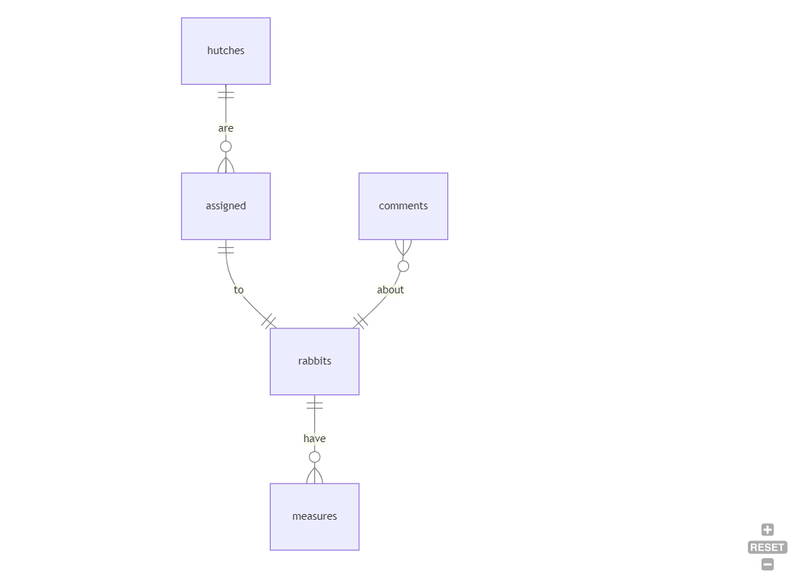

# Design Document

* Github: KamilKozera
* Edx: kamilkozera
* Kraków, Poland
* 2023-12-30

## HopLog - SQLite3 database for an android app by Kamil Kozera

Video overview: <https://youtu.be/xOVSK1bP5es>

## Scope

HopLog is a mobile android app that helps rabbit breeders keep track of animals and their measurements. The purpose of this database is to store, read and write data about rabbits across multiple hutches. The scope of the database contains:

* Hutches, including type, specification and dimensions
* Rabbits, including basic information about rabbits
* Measures, which allows weight, ear_lenght and ear_width measurements on a daily basis
* Comments, that allow users to make notes about rabbits
* Assigned, keeps track of rabbit accomodation

Out of scope are users, logins, passwords and other app functionalities like foods

## Functional Requirements

Within the database:

* Users can create hutches and assign rabbits to them
* Users can add multiple comments and measurements to a chosen rabbit
* Users can look up the history of comments and measurements for a chosen rabbit

## Representation

Entities are captured in SQLite tables with the following schema.

### Entities

The database contains following entities:

#### Hutches

The `hutches` table includes:

* `id`, which specifies a unique ID for the hutches as an `INTEGER`. The ID is the `PRIMARY KEY` in the `hutches` table.
* `type`, which specifies the location of the hutch as `TEXT`.
* `capacity`, which specifies the maximum number of rabbits allowed in the hutch as an `INTEGER`.
* `width`, which specifies the width of the hutch in centimeters as `NUMERIC`. The `NUMERIC` data type is chosen for storing dimension data because decimal accuracy is not required for calculations, if any are performed.
* `length`, which specifies the length of the hutch in centimeters as `NUMERIC`. `NUMERIC` is used for the same reason as `width`.
* `depth`, which specifies the depth of the hutch in centimeters as `NUMERIC`. `NUMERIC` is used for the same reason as `width` and `length`.

All columns in the `hutches` table are required and should have the `NOT NULL` constraint applied. The `type` column has an additional constraint applied to ensure that the value is either 'indoors' or 'outdoors'. Similarly, `capacity` has an additional constraint to check if the value is between 1 and 6, based on assumptions made during app planning.

#### Assigned

The `assigned` table includes:

* `hutch_id`, which is the ID of the hutch to whom the rabbit is assigned as an `INTEGER`.
* `rabbit_id`, which is the ID of the rabbit being assigned as an `INTEGER`.

All columns in the `assigned` table are required and should have the `NOT NULL` constraint applied.
An additional constraint is used for `rabbit_id`, which is set to `UNIQUE` to ensure that only one rabbit is assigned to the hutch.

#### Rabbits

The `rabbits` table includes:

* `id`, which specifies a unique ID for the rabbit as an `INTEGER`. The ID is the `PRIMARY KEY` in the `rabbits` table.
* `breed`, which specifies breed of the rabbit as `TEXT`.
* `gender`, which specifies gender of the rabbit as `TEXT`.
* `birth_date`, which specifies birth date as `NUMERIC`. The default value for the `birth_date` attribute is the current timestamp which provides current date when not provided by the user.
* `death_date`, which specifies death date as `NUMERIC`.
* `months_old`, which specifies number of months alive as `INTEGER`.
* `image`, which contains image data as `BLOB`.
* `active`, which is an `INTEGER` 0 or 1 and specifies if the rabbit is alive or not. The default value for the `active` is set to 1.

The `id`, `breed`, `gender`, `birth_date`, and `active` columns cannot be NULL. Additionally, `breed`, `gender`, and `active` have constraints to enhance data integrity.
The `breed` must be either 'Belgian gray giant', abbreviated as 'bgg', or 'New Zealand white rabbit' abbreviated as 'nzwr'.
The `gender` can have two values, 'male' or 'female'.
The `active` column might be 0, indicating the rabbit is deceased, or 1, meaning the rabbit is alive.

#### Measures

The `measures` table includes:

* `id`, which specifies a unique ID for the measure as an `INTEGER`. This ID serves as the `PRIMARY KEY` in the `measures` table.
* `rabbit_id`, which specifies the ID of the rabbit to which the measure is assigned as an `INTEGER`. This column has the `FOREIGN KEY` constraint applied, referencing the `id` column in the `rabbits` table to ensure data integrity.
* `date`, which specifies the date of the measure as `NUMERIC`. The default value for the `date` attribute is the current timestamp, providing the current date when not provided by the user.
* `weight`, which specifies the weight of the rabbit at the time of measurement as `NUMERIC`.
* `ear_length`, which specifies the length of the rabbit's ears at the time of measurement as `NUMERIC`.
* `ear_width`, which specifies the width of the rabbit's ears at the time of measurement as `NUMERIC`.

All columns in the `measures` table are required and should have the `NOT NULL` constraint applied. The `id` and `rabbit_id` columns have additional constraints to ensure data integrity. The `id` column serves as the `PRIMARY KEY`, and the `rabbit_id` column has a `FOREIGN KEY` constraint referencing the `id` column in the `rabbits` table.

#### Comments

The `comments` table includes:

* `id`, which specifies a unique ID for the comment as an `INTEGER`. This ID serves as the `PRIMARY KEY` in the `comments` table.
* `rabbit_id`, which specifies the ID of the rabbit associated with the comment as an `INTEGER`. This column is marked as `NOT NULL` and has a `FOREIGN KEY` constraint, referencing the `id` column in the `rabbits` table to ensure data integrity.
* `comment`, which specifies the content of the comment as `TEXT`. This column is marked as `NOT NULL`.

All columns in the `comments` table are required and have the `NOT NULL` constraint applied. The `id` column serves as the `PRIMARY KEY`, and the `rabbit_id` column has a `FOREIGN KEY` constraint referencing the `id` column in the `rabbits` table.

### Triggers

The database contains following triggers:

#### check_capacity

This trigger ensures that users cannot assign more rabbits to the hutch than the maximum capacity allowed for the hutch. The trigger compares values before insertion and allows insertion only when `COUNT(*)` for the selected `hutch_id` in the `assigned` table is less than the set `capacity` in the `hutches` table.

#### months_calc

This trigger calculates the age of a rabbit after insertion into the `rabbits` table. The trigger handles cases where the user provided a `death_date` and when they did not (indicating the rabbit is still alive).

#### non_active

After changing the `active` status in the `rabbits` table from the default of 1 to 0, the trigger sets the `death_date` to `CURRENT_TIMESTAMP`, calculates the final age, and deletes the rabbit from the `assigned` table.

### Relationships

The below entity relationship diagram describes the relationships among the entities in the database.

As detailed by the diagram:

* One rabbit can have 0 to many measures. 0, if no measurements have been recorded, and many if measurements have been taken for that rabbit. Simultaneously, one measure is made to one and only one rabbit.
* One comment is associated with one and only one rabbit. At the same time, a rabbit can have 0 to many comments: 0 if no comments have been made about the rabbit, and many if there are multiple comments about the rabbit.
* One hutch can have 0 to many assignments. 0, if no rabbits have been assigned to it, and many if multiple rabbits are assigned to that hutch. Simultaneously, one assignment can have only one hutch.
* One assignment is made to one and only one rabbit. At the same time, a rabbit can have only one assignment.

## Optimizations

Users often need to filter data based on hutches and rabbits assigned to them.
For instance, a user might want to find the oldest rabbit in a hutch.
To speed this process up, an index was created on the entire 'assigned' table.

## Limitations

The database can't handle multiple values inserts at once.
The database does not auto-update on select (for calculating age).

